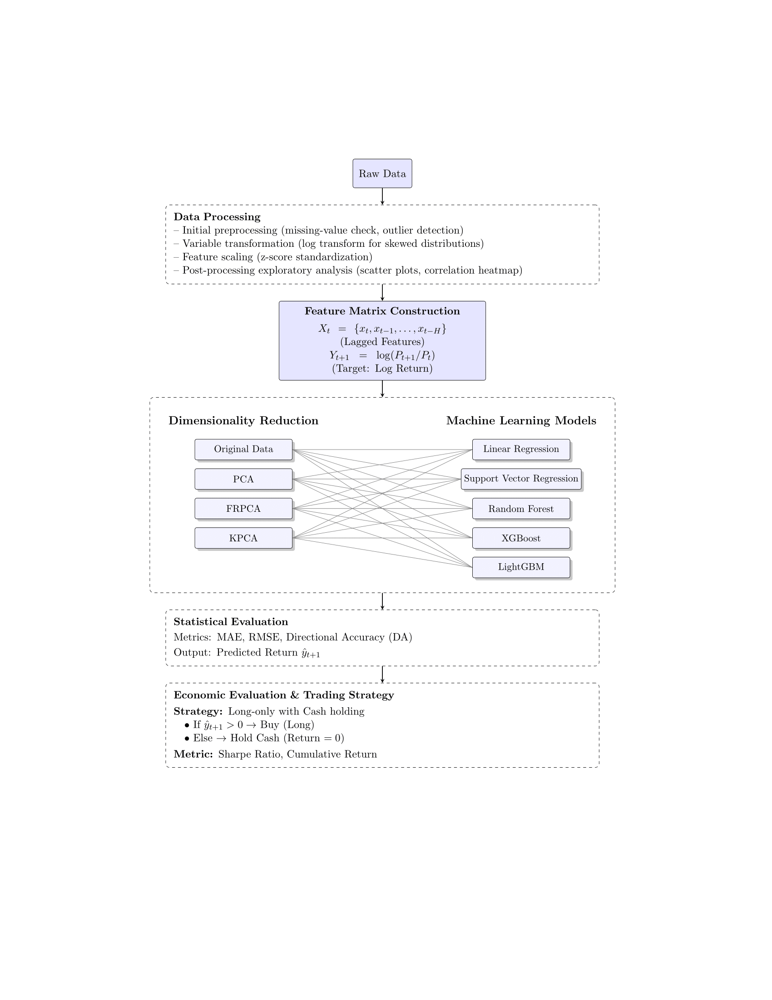

# [Project Name]: Decoding Market Movements: PCA-Enhanced Machine Learning for S&P 500 Log Return Prediction
**Authors:**
Katherine Liu, Huei-Wen Teng
)

---

## Abstract

We evaluate the effectiveness of nonlinear dimensionality reduction for
forecasting daily log returns of the S\&P 500. Using a time-series 5-fold
cross-validation, we compare three reduction techniques—PCA, fast robust
PCA (FRPCA) and kernel PCA (KPCA)—combined with five predictive models:
linear regression, support vector regression, random forest, XGBoost and
LightGBM. KPCA combined with ordinary linear regression (KPCA-LR)
yields the lowest out-of-sample mean absolute error (MAE) and the highest
directional accuracy, while LightGBM on the original features attains the
best Sharpe ratio in a simple long-only trading simulation. Our results
highlight a systematic statistical–economic disconnect: best statistical
predictors are not necessarily most profitable under a risk-adjusted
metric. We discuss implications for model selection in forecasting tasks
when practitioners prioritize predictive accuracy versus economic utility.

### Graphic Abstract

*Figure 1: Overview of the data processing pipeline and model architecture.*
