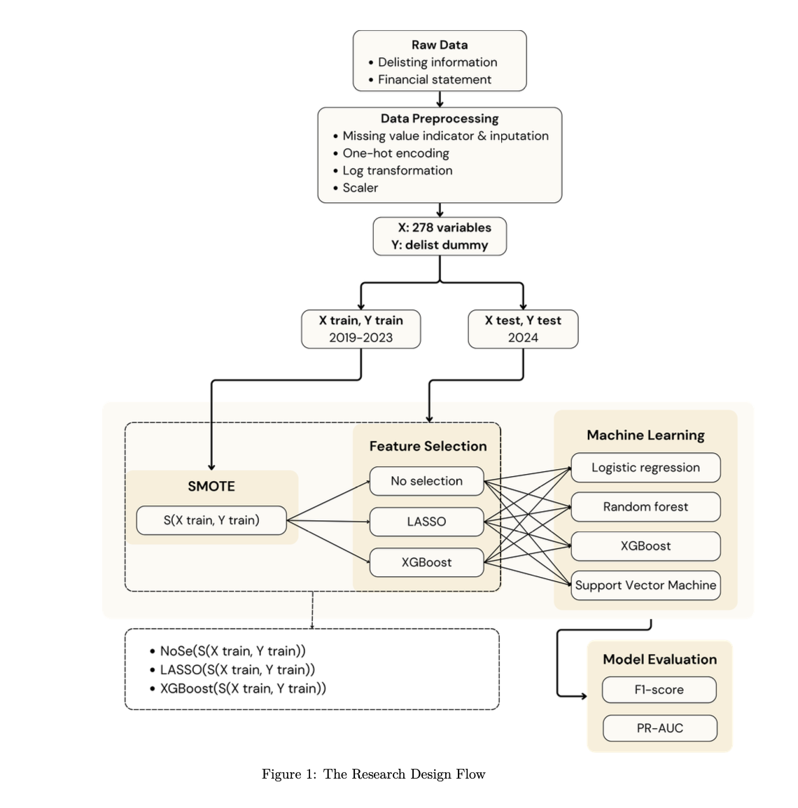

# Imbalance-Aware Feature Selection and Machine Learning for U.S. Corporate Bankruptcy Prediction
**Authors:**
Yun-Chen Li, Rou-Rou Yu, Yi-An Chen, Huei-Wen Tung

 

---

## Abstract

This study explores the application of financial statement features for
predicting the bankruptcy of U.S. companies. Accurate bankruptcy prediction
is vital for investors, financial institutions, and regulators to identify financial
distress early, mitigate potential losses, and maintain market stability. Ma-
chine learning techniques are employed to analyze variables derived from firms
balance sheets, income statements, and cash flow statements, capturing their
underlying financial structure and performance. A comprehensive dataset
of publicly listed U.S. firms is used to train and validate predictive mod-
els, including Random Forest, Support Vector Machine, Extreme Gradient
Boosting, and Logistic Regression algorithms. The results demonstrate that
financial statement features significantly improve the accuracy of bankruptcy
prediction compared with traditional statistical models (Logistic Regression).
Furthermore, the key financial variables identified by the models provide
valuable insights into the financial health of companies and the early warning
signs of distress. Overall, the findings highlight the potential of integrating
financial statement data and machine learning to enhance corporate failure
prediction and support better investment and risk management decisions.

### Graphic Abstract

*Figure 1: Overview of the data processing pipeline and model architecture.*
